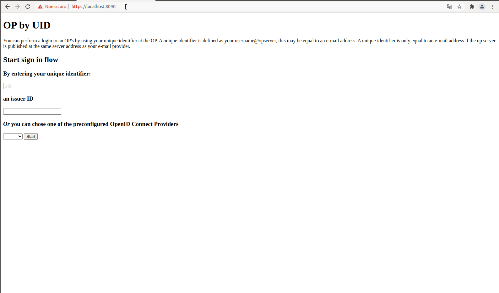

# SATOSA oidcop frontend

[](https://github.com/UniversitaDellaCalabria/SATOSA-oidcop/actions)
[](./LICENSE)
[](https://pypi.org/project/satosa-oidcop/)
[](https://pepy.tech/project/satosa-oidcop)
[](https://pepy.tech/project/satosa-oidcop)
[](https://pypi.org/project/satosa-oidcop/)
[](https://conventionalcommits.org/)

SATOSA Frontend based on [idpyoidc by Identity Python](https://github.com/IdentityPython/idpy-oidc)
(previously [identity python oidcop](https://github.com/IdentityPython/oidc-op)).

## Features

Endpoints:

- [x] provider discovery
- [x] jwks uri
- [x] authorization
- [x] token
- [x] userinfo
- [x] registration
- [x] registration_read endpoint
- [x] introspection endpoint
- [ ] token exchange

## Requirements

- satosa
- mongodb, see [Satosa-Saml2Spid mongo example](https://github.com/italia/Satosa-Saml2Spid/blob/master/README.mongo.md).

## Setup

```sh
pip install satosa_oidcop
```

## Configuration

Anyone can migrate its oidcop configuration, from flask_op or django-oidc-op
or whatever, in SATOSA and without any particular efforts. Looking at the
[example configuration](example/oidcop_frontend.yaml) we see that
`config.op.server_info` have a standard SATOSA configuration with the only
addition of the following customizations, needed in SATOSA for interoperational
needs. These are:

- autentication

```yaml
        authentication:
          user:
            acr: urn:oasis:names:tc:SAML:2.0:ac:classes:InternetProtocolPassword
            class: satosa.frontends.oidcop.user_authn.SatosaAuthnMethod
```

- userinfo

```yaml
       userinfo:
         class: satosa.frontends.oidcop.user_info.SatosaOidcUserInfo
```

**authentication** inherits `oidcop.user_authn.user.UserAuthnMethod`
and overloads two methods involved in user authentication and verification.
These tasks are handled by SATOSA in its authentication backends.

**userinfo** inherits `oidcop.user_info.UserInfo` and proposes a way to store
the claims of the users when they comes from the backend. The claims are stored
in the session database (actually mongodb) and then they will be fetched during
userinfo endpoint (and also token endpoint, for having them optionally
in id_token claims).

### SSO and cookies

oidcop SSO and cookies were not have been implemented because SATOSA does not
support logout, because of this they are quite useless at this moment.

### Client and Session Storage

MongoDB is the storage, [here](https://github.com/italia/Satosa-Saml2Spid/tree/oidcop/mongo)
some brief descriptions for a demo setup. The interface to SATOSA oidcop
storage is `satosa.frontends.oidcop.storage.base.SatosaOidcStorage` and it has
three methods:

- **get_client_by_id**(self, client_id:str, expired:bool = True)
- **store_session_to_db**(self, session_manager, \*\*kwargs)
- **load_session_from_db**(self, req_args, http_headers, session_manager, \*\*kwargs)

`satosa.frontends.oidcop.storage.mongo.Mongodb` overloads them to have I/O
operations on mongodb.

#### Subject type

The client configuration can also include the `subject_type` key,
with permitted values being `public` and `pairwise`. If absent, the default is
to choose `public`. This has been driven by backwards compatibility
with existing behaviour: oidcop (`session_manager.create_session`)
defaults to `public`.

For user privacy, we strongly recommend selecting `pairwise` for
new deployments, unless `public` is absolutely needed
(for linking users across related but distinct services).

## Demo

[Satosa-Saml2Spid](https://github.com/italia/Satosa-Saml2Spid/) is a custom
Satosa configuration to deal with many SAML2 and OIDC Relying parties
and many eduGain and SPID Identity Provider.



## Contributions

Feel free to open issues and pull requests, we build communities!

## Developer notes

### Storage design

At this time the storage logic is based on oidcop session_manager
load/dump/flush methods. Each time a request is handled by an endpoint,
the oidcop session manager loads the definition from the storage,
**only which one are strictly related to the request will be loaded**
in the in memory storage of oidcop.

### Roadmap

- [x] unit tests
- [x] pytest mongo mock
- [x] test response_type = "code id_token token" ([hybrid flow](https://github.com/IdentityPython/SATOSA/pull/378/commits/a61dc99503bcb9d4982b77a6ddcf0c41b6732915))
- [x] auto prune expired sessions with mongodb index
      ([auto prune](https://github.com/IdentityPython/SATOSA/pull/378/commits/137993f77bfb05b44f25ba6df3784e8fb86a31ce),
      [mongo index](https://github.com/italia/Satosa-Saml2Spid/tree/oidcop/mongo#create-expired-session-deletion))
- [x] [token refresh](https://github.com/IdentityPython/SATOSA/pull/378/commits/59c0a53fa73e70551d76c5355c051a7389ab99fd)
- [ ] DPoP support

### Tests

Before you run the tests mind that you've to start a local mongod instance,
e.g. with:

```sh
sudo docker run \
  --rm \
  -e ALLOW_EMPTY_PASSWORD=yes \
  -e MONGODB_ENABLE_JOURNAL=false \
  -p 27017:27017 \
  --name mongodb \
  bitnami/mongodb:latest
```

If you like you can use mongo-express as a management UI over the local mongo instance:

```sh
sudo docker run \
  -e ME_CONFIG_MONGODB_SERVER=$MONGOHOST-OR-DOCKER-BRIDGE-LIKE-172.17.0.1 \
  -p 8081:8081 \
  mongo-express
```

Then run the tests:

```sh
pip install pytest pytest-cov
pytest --cov=satosa_oidcop -v --cov-report term --cov-fail-under=95 tests/
```

## Authors

- Giuseppe De Marco @ Università della Calabria

## Credits

- Roland Hedberg
- Andrea Ranaldi @ ISPRA Ambiente
- Pavel Břoušek @ CESNET
- Identity Python Community
